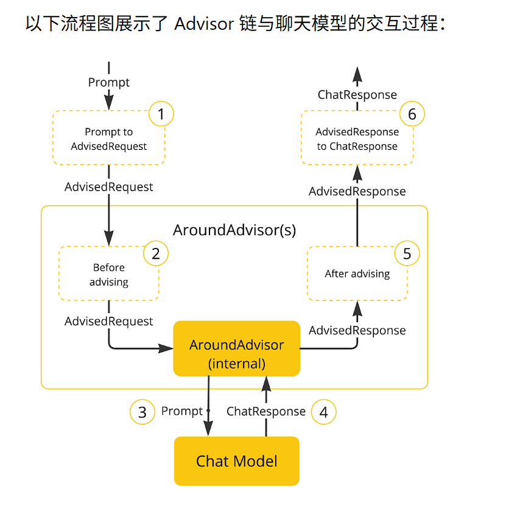

- [Advisor API](#advisor-api)
  - [一、Advisor定义](#一advisor定义)
  - [二、核心组件](#二核心组件)
    - [2.1 顶层基础接口](#21-顶层基础接口)
    - [2.2 两条核心分支接口（同步 / 流式）](#22-两条核心分支接口同步--流式)
      - [同步非流式：`CallAroundAdvisor` extends Advisor](#同步非流式callaroundadvisor-extends-advisor)
      - [流式：`StreamAroundAdvisor` extends Advisor](#流式streamaroundadvisor-extends-advisor)
    - [2.3 核心分支链接口](#23-核心分支链接口)
      - [`CallAroundAdvisorChain`](#callaroundadvisorchain)
      - [`StreamAroundAdvisorChain`](#streamaroundadvisorchain)
    - [2.4 数据模型类](#24-数据模型类)
    - [2.5 内置Advisor类](#25-内置advisor类)
  - [三、执行流程](#三执行流程)
  - [四、实现Advisor](#四实现advisor)

# Advisor API

## 一、Advisor定义

Advisor 是 Spring AI 的**拦截增强切面机制**，类似 AOP，在 ChatClient 与 LLM 交互的请求前、响应后做拦截修改，支持同步 / 流式两条链路Spring

## 二、核心组件

### 2.1 顶层基础接口

Advisor是顶层接口

~~~java
public interface Advisor extends Ordered {
    String getName(); // 获取Advisor唯一名称
    int getOrder();   // Ordered，定义链中执行顺序，越小越先执行
}
~~~

>[!TIP]
所有的advisor都会继承它，getName用来识别、日志。

### 2.2 两条核心分支接口（同步 / 流式）

#### 同步非流式：`CallAroundAdvisor` extends Advisor

~~~java
AdvisedResponse aroundCall(AdvisedRequest advisedRequest, CallAroundAdvisorChain chain);

~~~

- `AdvisedRequest`：**可修改的请求体**（prompt、chatOptions、adviseContext 上下文），unsealed 未提交给模型
- `CallAroundAdvisorChain`：调用 `chain. nextAroundCall()` 执行链中下一个 Advisor；不调用 next 就阻断请求
- 返回 `ChatClientResponse`：模型响应，可修改后返回上游

#### 流式：`StreamAroundAdvisor` extends Advisor

~~~java
 Flux<AdvisedResponse> aroundStream(AdvisedRequest advisedRequest, StreamAroundAdvisorChain chain);

~~~

>[!TIP]

- 流式返回 `Flux<AdvisedResponse>`，适配大模型流式输出场景
- `StreamAdvisorChain.nextAroundStream(request)` 继续执行链路

注意的是以上都是新版本（1.0+）的版本，旧版本有所差别

### 2.3 核心分支链接口

#### `CallAroundAdvisorChain`

~~~java
public interface CallAroundAdvisorChain {

 AdvisedResponse nextAroundCall(AdvisedRequest advisedRequest);

}
~~~

#### `StreamAroundAdvisorChain`

~~~java
public interface CallAroundAdvisorChain {

 AdvisedResponse nextAroundCall(AdvisedRequest advisedRequest);

}
~~~

### 2.4 数据模型类

- `ChatClientRequest`：待发送给模型的请求，包含 Prompt、ChatOptions、`adviseContext`（Map，Advisor 之间共享状态），**可修改 prompt**
- `ChatClientResponse`：模型返回结果，包装 ChatResponse + `adviseContext`
- `AdvisorContext`：贯穿整个 Advisor 链的共享上下文，跨 Advisor 传递自定义参数（非常关键）

### 2.5 内置Advisor类

1. **`MessageChatMemoryAdvisor`**：对话记忆，加载历史消息追加进 Prompt，实现多轮对话
2. **`QuestionAnswerAdvisor`**：RAG 检索增强，向量库检索相关文档注入 prompt
3. **`ToolCallingAdvisor`**：工具调用 Advisor，处理 function call 循环调用（Spring AI2.0 后工具调用逻辑迁移到 Advisor）
4. **`LoggingAdvisor`**：打印请求 / 响应日志，调试使用
5. **`TokenCountAdvisor`**：统计 token，做长度校验、限流
6. **`GuardrailsAdvisor`**：输入输出内容审核，安全护栏

## 三、执行流程

- prompt请求进入后，在chatmodel调用LLM之前，会被写成一个`AdvisedRequest`类，并创建空的`AdvisorContext`，本质就是map<String,object>。来实现共享上下文。
- 然后经过设定好的顺序或者依据类似栈的规则，后链首advisor先生效，advisor可以选择放行也可中断请求。
- 调用LLM后返回的请求，再次经历advisor，默认是栈，链末的最先执行，返回的是一个`AdvisedResonse`里面包含`AdvisorContext`,以及`ChatResponce`；

## 四、实现Advisor

创建 `Advisor` 需实现 `CallAroundAdvisor` 或 `StreamAroundAdvisor`（或两者）。核心实现方法是：非流式用 `nextAroundCall()` ，流式用 `nextAroundStream()`。

上下文修改的实例：

~~~java
@Override
public AdvisedResponse aroundCall(AdvisedRequest advisedRequest, CallAroundAdvisorChain chain) {

    this.advisedRequest = advisedRequest.updateContext(context -> {
        context.put("aroundCallBefore" + getName(), "AROUND_CALL_BEFORE " + getName());  // Add multiple key-value pairs
        context.put("lastBefore", getName());  // Add a single key-value pair
        return context;
    });

    // Method implementation continues...
}
~~~
