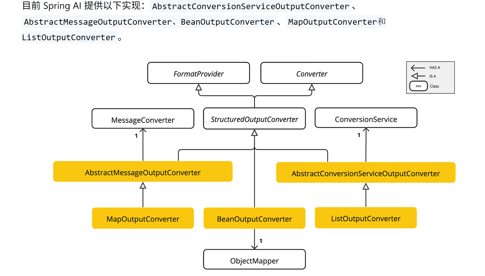

- [结构化输出转化器](#结构化输出转化器)
  - [一、基本概念](#一基本概念)
    - [1.1 什么是转化器](#11-什么是转化器)
    - [1.2 有哪些结构器](#12-有哪些结构器)
    - [支持的AI模型](#支持的ai模型)
  - [二、基本用法](#二基本用法)
    - [2.1 入门实例](#21-入门实例)
    - [2.2 BeanOutPutConverter](#22-beanoutputconverter)
      - [生成模式中的属性顺序](#生成模式中的属性顺序)
    - [2.3 ListOutPutConverter](#23-listoutputconverter)
    - [2.4 MapOutPutConverter](#24-mapoutputconverter)

# 结构化输出转化器

## 一、基本概念

### 1.1 什么是转化器

就是springAI封装好的类，可以生成format，让LLM将返回的接过映射 为JSON、XML 或领域特定数据结构等对应的结构化数据表示。

### 1.2 有哪些结构器


Spring AI 内置 3 个可用结构化转换器：`BeanOutputConverter`映射 Java 实体，`MapOutputConverter`转为 Map，`ListOutputConverter`转为字符串 List；另外两个抽象类`AbstractMessageOutputConverter`、`AbstractConversionServiceOutputConverter`是扩展基类，不能直接实例化。

### 支持的AI模型

并不是所有都可以，只有部分可以，具体见官方文档

## 二、基本用法

### 2.1 入门实例

就是将转化器生成的format加入到prompt中即可

~~~java
    StructuredOutputConverter outputConverter = ...
    String userInputTemplate = """
        ... user text input ....
        {format}
        """; // 包含 "format" 占位符的用户输入。
    Prompt prompt = new Prompt(
       new PromptTemplate(
      this.userInputTemplate,
          Map.of(..., "format", outputConverter.getFormat()) // 将 "format" 占位符替换为转换器的格式指令。
       ).createMessage());
~~~

### 2.2 BeanOutPutConverter

将LLM返会的结果按照自己定义的实体类返回
<br>

这里是调用的底层API

~~~java
//定义一个实体类
record ActorsFilms(String actor, List<String> movies) {
}

//转化器构造时传入目标实体类的字节码
BeanOutputConverter<ActorsFilms> beanOutputConverter =
    new BeanOutputConverter<>(ActorsFilms.class);

//获取生成的提示词
String format = this.beanOutputConverter.getFormat();

String actor = "Tom Hanks";

String template = """
        Generate the filmography of 5 movies for {actor}.
        {format}
        """;

//由于调用的是底层chatModel.call()就直接调用大模型，参数类型就是prompt，这里create就返回了prompt
Generation generation = chatModel.call(
    new PromptTemplate(this.template, Map.of("actor", this.actor, "format", this.format)).create()).getResult();

//由于LLM返回的是字符串，所以我们需要调用convert方法传入字符串，转化成目标实体类
ActorsFilms actorsFilms = this.beanOutputConverter.convert(this.generation.getOutput().getText());
~~~

>[!TIP]
 `BeanOutputConverter.getFormat()` 返回的是**一整段英文提示字符串**
它由两部分拼接而成：<br>1. **指令文本**：命令大模型只能输出纯 JSON，不能写解释、不能带 ```json 标记<br>2. **自动生成的 JSON Schema**：根据你传入的 Java 实体 / Record 自动推导出来的结构定义

以上是底层写法，我们可以借助**ChatClient**中的**entity**简化写法

~~~java
ActorsFilms actorsFilms = ChatClient.create(chatModel).prompt()
        .user(u -> u.text("Generate the filmography of 5 movies for {actor}.")
                    .param("actor", "Tom Hanks"))
        .call()
        .entity(ActorsFilms.class);
~~~

>[!NOTE]
这里的user底层就使用可PromptTemplate，entity就调用了BeanOutPutConverter

#### 生成模式中的属性顺序

`BeanOutputConverter` 通过 `@JsonPropertyOrder` 注解支持自定义 JSON Schema 中的属性顺序，该注解允许指定属性在模式中的精确出现顺序（无视 class 或 record 中的声明顺序）。

~~~java
@JsonPropertyOrder({"actor", "movies"})
record ActorsFilms(String actor, List<String> movies) {}
~~~

### 2.3 ListOutPutConverter

将返回结果转化成List列表<br>
底层ChatModel API：

~~~java
ListOutputConverter listOutputConverter = new ListOutputConverter(new DefaultConversionService());

String format = this.listOutputConverter.getFormat();
String template = """
        List five {subject}
        {format}
        """;

Prompt prompt = new PromptTemplate(this.template,
        Map.of("subject", "ice cream flavors", "format", this.format)).create();

Generation generation = this.chatModel.call(this.prompt).getResult();

List<String> list = this.listOutputConverter.convert(this.generation.getOutput().getText());
~~~

简化写法：

~~~java
List<String> flavors = ChatClient.create(chatModel).prompt()
                .user(u -> u.text("List five {subject}")
                            .param("subject", "ice cream flavors"))
                .call()
                .entity(new ListOutputConverter(new DefaultConversionService()));
~~~

### 2.4 MapOutPutConverter

将结果转化成Map集合 <br>

底层ChatModel API：

~~~java
MapOutputConverter mapOutputConverter = new MapOutputConverter();

String format = this.mapOutputConverter.getFormat();
String template = """
        Provide me a List of {subject}
        {format}
        """;

Prompt prompt = new PromptTemplate(this.template,
        Map.of("subject", "an array of numbers from 1 to 9 under they key name 'numbers'", "format", this.format)).create();

Generation generation = chatModel.call(this.prompt).getResult();

Map<String, Object> result = this.mapOutputConverter.convert(this.generation.getOutput().getText());
~~~

简化写法：

~~~java
Map<String, Object> result = ChatClient.create(chatModel).prompt()
        .user(u -> u.text("Provide me a List of {subject}")
                    .param("subject", "an array of numbers from 1 to 9 under they key name 'numbers'"))
        .call()
        .entity(new ParameterizedTypeReference<Map<String, Object>>() {});
~~~
