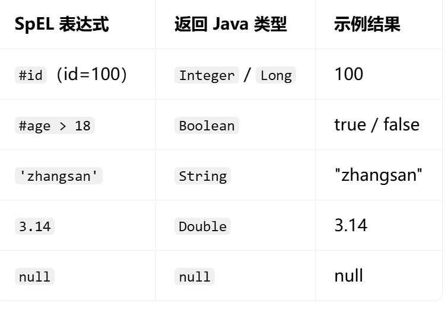

- [SpEL语法](#spel语法)
  - [一、基本概念](#一基本概念)
  - [二、语句语法](#二语句语法)
  - [三、关键类](#三关键类)
  - [四、基础用法](#四基础用法)
    - [1.解析](#1解析)
    - [2.创建上下文](#2创建上下文)
    - [3.返回值](#3返回值)
      - [3.1 返回基本类型](#31-返回基本类型)
      - [3.2 POJO](#32-pojo)
      - [3.3 集合、数组](#33-集合数组)
      - [3.4 map](#34-map)
      - [3.5 逗号表达式](#35-逗号表达式)

# SpEL语法

## 一、基本概念

SpEL 是 Spring 自带的**动态表达式语言**，可以在**运行期**动态求值，支持访问对象属性、调用方法、算术 / 逻辑运算、读取方法参数。

>
> 核心标识：`#{表达式}`，这才是 SpEL；`${}`是读取配置文件占位符，**不属于 SpEL**。

## 二、语句语法

~~~
#id                                  // 获取变量id
#user.name                           // 对象属性
#user.getName()                      // 调用对象方法
#id + '_' + #name                    // 多变量拼接（缓存key最常用）
#age > 18                            // 比较运算
#score>60 ? 'pass' : 'fail'          // 三元表达式
#name != null and #name != ''        // 逻辑 and or not
T(java.util.UUID).randomUUID()       // 静态方法调用
#args[0]                             // 参数数组第0项
~~~

## 三、关键类

`SpelExpressionParser`,`Expression`,`EvaluationContext`

~~~java
SpelExpressionParser parser = new SpelExpressionParser();
Expression expression = parser.parseExpression(distributeLock.keyExpression());//这里是自定义的注解中的成员属性，用来存储字符串型的SpEL

EvaluationContext context = new StandardEvaluationContext();
~~~

- `SpelExpressionParser`:是一个专门用来解析字符串类型的SpEL语句的类，并且返回SpelExpression
- `Expression`（SpelExpression）对象，内部是**抽象语法树 AST**，是结构化的数据，已经把表达式拆解好了，支持后续求值。
- `EvaluationContext`上下文存储值，以便于Expression从中获取值

>[!TIP]
`Expression`, `EvaluationContext`都是对应接口的实现类

## 四、基础用法

### 1.解析

~~~java
SpelExpressionParser parser = new SpelExpressionParser();
Expression expression = parser.parseExpression(distributeLock.keyExpression());//这里是自定义的注解中的成员属性，用来存储字符串型的SpEL
~~~

### 2.创建上下文

将可能需要的参数，以及参数值传入上下文中，这里是将某个方法中的参数以及参数值传入了 

这里pjp是AOP类process方法中定义的参数名

~~~java
//获取方法
Method method = ((MethodSignature) pjp.getSignature()).getMethod();
EvaluationContext context = new StandardEvaluationContext();
// 获取参数值
Object[] args = pjp.getArgs();

// 获取运行时参数的名称
StandardReflectionParameterNameDiscoverer discoverer = new StandardReflectionParameterNameDiscoverer();
String[] parameterNames = discoverer.getParameterNames(method);

// 将参数绑定到context中
if (parameterNames != null) {
    for (int i = 0; i < parameterNames.length; i++) {
        context.setVariable(parameterNames[i], args[i]);
                }
            }
~~~

>[!TIP]
这里获取参数名称是一种底层写法，也可以选择AOP封装的方法通过`getSignature()`然后`getParameterNames()`获取参数，底层就是上面的写法

### 3.返回值

~~~java

Object res = expression.getValue(context)

~~~

利用Experssion类，以及上下文返回SpEL执行后的值，类型是Object可以自行转化

#### 3.1 返回基本类型

#### 3.2 POJO

表达式：`#user`
返回：你自己的实体类对象 `User`

#### 3.3 集合、数组

~~~java
String spel = "{#name,#age}";
Expression exp = parser.parseExpression(spel);
Object res = exp.getValue(context);
// res 是 List，里面两个元素：张三，20
List<?> list = (List<?>) res;
~~~

#### 3.4 map

~~~
#{name:'张三',age:20}
~~~

#### 3.5 逗号表达式

~~~
（#name,#age），这是就会返回最后一个age的值，因为都好代表顺序执行
~~~
